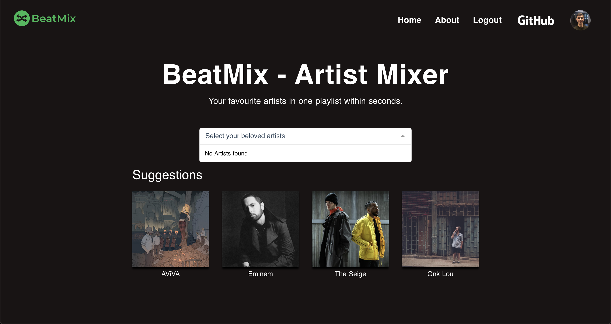

# BeatMix - Artist Mixer

> The Artist Mixer that let&#39;s you select a list of your favourite artists from which all tracks are put into one new playlist for you to hear up and down all day long.

## :wave: Short intro
I spend a lot of time on Spotify. This year even more than ever and that's when I got the idea for BeatMix.

Did you ever had the luck of discovering an artist which you can listen to all day long because they don't really have
any song that you don't like? This amazing feeling when you can just open Spotify, get on the artists profile and click shuffle
without having to worry if you like the songs that come up.

The only thing better than this is to be able to shuffle between multiple of your favourite artists and all their songs.
And this is exactly what BeatMix enables you to do. Connect with your Spotify account, search for your beloved artists and
create a playlist with all their songs within seconds.

## :oncoming_automobile: RoadMap

- [ ] provide option to filter out Intstrumental, Commenatary and Live versions of Songs

### Still in ideation
- [ ] see global recently created playlists as inspiration

## :computer: Contribution
Welcome to improve this little project of mine with any issue, pull request or code review!

